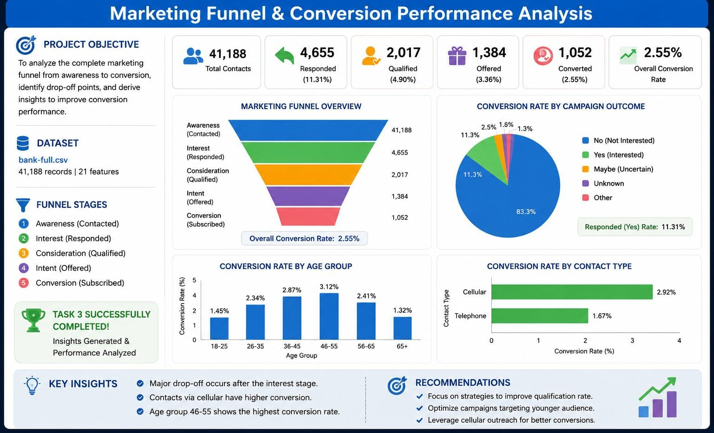

# FUTURE_DS_03

# Marketing Funnel & Conversion Performance Analysis

## Project Overview

This project analyzes bank marketing campaign data to understand the marketing funnel, identify conversion drop-offs, evaluate channel performance, and find opportunities to improve lead-to-customer conversion.

## Project Dashboard

## Dataset

The analysis uses the **Bank Marketing Dataset (`bank-full.csv`)**, which contains customer information, campaign details, contact methods, and subscription outcomes.

## Tools & Technologies

- Python
- Pandas
- NumPy
- Matplotlib
- VS Code

## Analysis Performed

- Data loading and exploration
- Data cleaning and validation
- Marketing funnel analysis
- Lead-to-contact conversion analysis
- Contact-to-customer conversion analysis
- Conversion drop-off analysis
- Contact channel performance analysis
- Campaign performance analysis
- Customer segment analysis
- Data visualization
- Business insights and recommendations

## Key Insights

- The analysis identifies major drop-offs between different stages of the marketing funnel.
- Conversion performance varies across different contact channels.
- Some campaign contact frequencies perform better than others.
- Customer characteristics and previous campaign outcomes influence conversion.
- Improving targeting and focusing on effective channels can help increase conversions.

## Recommendations

- Focus marketing efforts on high-performing contact channels.
- Improve targeting of customers with higher conversion potential.
- Optimize the number and timing of campaign contacts.
- Reduce ineffective contacts to minimize customer drop-offs.
- Use previous campaign outcomes to improve future targeting strategies.

## Conclusion

The marketing funnel analysis helps identify where potential customers are lost and which channels and campaign strategies perform better. The insights can be used to improve customer targeting, optimize marketing campaigns, reduce funnel drop-offs, and increase overall conversion performance.

## Project Files

- `FUTURE_DS_03_Marketing_Funnel_Analysis.ipynb` – Complete analysis and visualizations
- `bank-full.csv` – Dataset used for the analysis
- `README.md` – Project documentation
